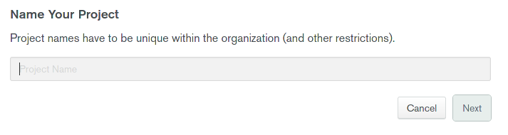
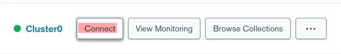
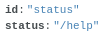

# TranslatorBOT

it is a simple and powerful discord bot, it been used for translating includes more than 100 language, it has a lot of integrated commands, includes a lot of systems for translating and leveling and economy.


# Getting Started

First let me show you the commands and then i will show you how to set it up

the commands:

1. <code>/translate (language) (text)</code>
2. <code>/detect (text)</code>
3. <code>/help</code>
4. <code>/langs</code>
5. <code>/coins amount [user]</code>
6. <code>/coins daily</code>
7. <code>/coins transfer (amount) (user)</code>
8. <code>/profile [user]</code>
9. <code>/top levels</code>
10. <code>/top coins</code>
11. <code>/rp (user)</code>
12. <code>/ping</code>
13. <code>/autotrans (channel) (language)</code>
14. <code>/multitrans (channel) (language1) (language2)</code>
15. <code>/remove all</code>
16. <code>/remove multitrans (channel)</code>
17. <code>/remove autotrans (channel)</code>
18. <code>/dislvl {owner only}</code>
19. <code>/enblvl {owner only}</code>


# Now i will show you how to set up the bot

First go to <a href='https://discord.com/developers/applications'>Discord developer portal</a> and login after you logged in with you discord account follow this steps

1. Create an app


2. Name your app


3. Go to bot session


4. Click add bot


5. And then copy the token (Be careful and do not give your bot token to any one!)


6. Before that lets add the bot in our server by clicking on OAuth2 session


7. Then scroll down and choose like this


8. Then scroll down and choose bot's permission and make sure you choose this as default


And then copy the invite link and invite it to your server.


# Now lets set up the database

First Go to <a href='https://www.mongodb.com/'>MongoDB</a> and create an account and then follow this setps

1. Create a project


2. Name your project



3. Then click on `Create Project`


4. Then click build a database


5. Then choose the free shared


6. Then choose the `cloud provider & region`


7. Then click on `create cluster` and wait for moments


8. Then click `Network Access` 


9. Then click on `Add IP Adress`


10. Then click on `Allow access from anywhere` then click on confirm


11. Then click on `Browse Collections`


12. Then click on `Add My Own Data`


13. Then make sure to name it as i am doing and click on create


14. Then click on the `+` sign and add the following list [multiat, dislvl, autotrans_channels, autotranslated_words, status, translated_words, usr_card, usr_lvl]


15. Then back to the database and click on `Connect`



16. Then choose a user name and password for the database user then click `Create Database User`


17. Then click on `Choose a connection method` 


18. Then click on `Connect your application`


19. Then choose like this


20. Then copy the connection link and do not give it to any one and replace `<password>` with your database user password


* If you want to change the bot status go to the database and then go to `status` in collections and insert a document like this




## Now lets see config.json

In config.json you will see:

```json
{
    "token": "Your bot token",
    "client": "link to connect to your mongodb client",
    "langs": ["en", "ar", "fr", "hi", "af", "sq", "am", "hy", "az", "eu", "be", "bn", "bs", "bg", "ca", "ceb",
        "ny", "zh-cn", "zh-tw", "co", "hr", "cs", "da", "nl", "eo", "et", "tl", "fi", "fy", "gl", "ka", "de", "el",
        "gu", "ht", "ha", "haw", "iw", "he", "hmn", "hu", "is", "ig", "id", "ga", "it", "ja", "jw", "kn", "kk",
        "km", "ko", "ku", "ky", "lo", "la", "lv", "lt", "lb", "mk", "mg", "ms", "ml", "mt", "mi", "mr", "mn", "my",
        "ne", "no", "ps", "fa", "pl", "pt", "pa", "ro", "ru", "sm", "gd", "sr", "st", "sn", "sd", "si", "sk",
        "sl", "so", "es", "su", "sw", "sv", "tg", "ta", "te", "th", "tr", "uk", "ur", "uz", "vi", "cy", "xh",
        "yi", "yo", "zu"],
    "dkey1": "langdetect token1",
    "dkey2": "langdetect token2",
    "dkey3": "langdetect token3"
}
```

1. in `"token"` you have to put your bot's token 
2. in `"client"` you have to put your database client
3. in `"dkey1"` and `"dkey2"` and `"dkey3"` put 3 APIs from `https://detectlanguage.com/` after you create an account 

Now your ready to upload your bot congrats!
